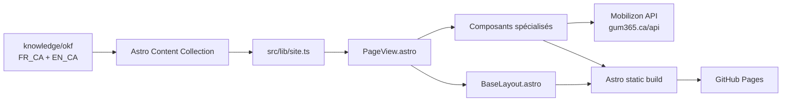

# GUM365 - Site Astro + Velocity + OKF

Ce dépôt contient le site principal GUM365 publié avec GitHub Pages. Il est construit avec Astro 6, utilise une présentation dérivée de Velocity et stocke le contenu éditorial dans une couche OKF bilingue.

Le principe à retenir est simple :

> Le contenu vit dans `knowledge/okf`, la présentation vit dans `src`, Mobilizon fournit les événements en direct, et GitHub Actions construit puis publie le site depuis `main`.

## Vue d'ensemble



### Technologies

- **Astro 6** pour la génération statique.
- **TypeScript** pour le code et la validation.
- **Velocity** comme référence de design et de composition UI.
- **OKF** comme couche de contenu structurée dans `knowledge/okf`.
- **FR_CA** comme source de vérité éditoriale.
- **EN_CA** comme traduction associée par `translation_key`.
- **Mobilizon** à `https://gum365.ca` comme plateforme communautaire et événementielle.
- **GitHub Actions** pour la validation, le build et le déploiement GitHub Pages.

## Structure du dépôt

```text
.
├── .github/
│   └── workflows/
│       └── deploy.yml
├── docs/
│   ├── README.md
│   ├── architecture.md
│   ├── content-maintenance.md
│   ├── branding-strategy.md
│   ├── brand-kit.md
│   ├── integrations.md
│   ├── deployment.md
│   └── seo-ai-discovery.md
├── knowledge/
│   └── okf/
│       ├── fr-CA/
│       └── en-CA/
├── public/
│   ├── gum365-icon-v2.png
│   ├── robots.txt
│   └── llms.txt
├── src/
│   ├── components/
│   ├── layouts/
│   ├── lib/
│   ├── pages/
│   ├── styles/
│   └── content.config.ts
├── CHANGELOG.md
├── astro.config.mjs
├── package.json
└── README.md
```

## Comment une page est générée

Astro ne duplique pas les contenus dans `src/content`. La collection `pages` définie dans `src/content.config.ts` charge directement les fichiers Markdown de `knowledge/okf/{fr-CA,en-CA}`.

Chaque page possède notamment :

- un `slug`,
- une langue,
- un `translation_key`,
- un ordre de navigation,
- les textes du hero,
- les CTA éventuels.

`src/lib/site.ts` fournit les helpers qui construisent les URLs, la navigation et le lien vers la traduction correspondante.

Les routes sont ensuite générées par :

- `src/pages/index.astro` pour la page d'accueil FR_CA,
- `src/pages/en-ca/index.astro` pour la page d'accueil EN_CA,
- `src/pages/[...slug].astro` pour toutes les autres pages.

Toutes les pages passent par `src/components/PageView.astro`, qui choisit ensuite les composants spécialisés lorsque nécessaire.

## Pages spécialisées

Certaines pages ont un comportement supplémentaire en plus de leur contenu OKF :

| `translation_key` | Composant | Fonction |
| --- | --- | --- |
| `home` | `NextMobilizonEvent.astro` | Affiche le prochain événement publié dans Mobilizon |
| `events` | `MobilizonEvents.astro` | Affiche la liste des prochains événements Mobilizon |
| `partners` | `PartnersPage.astro` | Rend la page partenaires avec les composants inspirés de Velocity |

Les événements ne doivent pas être recopiés manuellement dans le dépôt. Mobilizon est la source de vérité événementielle.

## Modifier une page existante

1. Modifier d'abord le fichier FR_CA dans `knowledge/okf/fr-CA`.
2. Mettre à jour le champ `updated`.
3. Adapter ensuite la version EN_CA correspondante.
4. Conserver le même `translation_key` dans les deux langues.
5. Vérifier localement avec `pnpm build`.
6. Ouvrir un PR vers `main`.
7. Ajouter l'évolution dans `CHANGELOG.md`.

Exemple :

```bash
pnpm install
pnpm dev
pnpm build
```

## Ajouter une nouvelle page

Une nouvelle page standard ne nécessite généralement pas de nouvelle route Astro.

Créer d'abord :

```text
knowledge/okf/fr-CA/nouvelle-page.md
knowledge/okf/en-CA/new-page.md
```

Les deux fichiers doivent partager le même `translation_key`. Le `slug` contrôle l'URL et `nav_order` contrôle la position dans la navigation.

Exemple de frontmatter minimal :

```yaml
---
type: page
id: example
title: "Titre de la page"
description: "Description SEO de la page."
slug: "exemple"
language: fr-CA
source_of_truth: true
translation_key: example
translation_status: source
updated: "2026-10-10"
nav_label: "Exemple"
nav_order: 5
hero_eyebrow: "GUM365"
hero_title: "Titre du hero"
hero_lead: "Texte d’introduction."
primary_label: "Action"
primary_url: "https://gum365.ca"
---
```

Pour une page nécessitant un affichage spécialisé, ajouter un composant dans `src/components` et déclencher son rendu depuis `PageView.astro` avec le `translation_key`.

Voir [docs/content-maintenance.md](docs/content-maintenance.md) pour la procédure détaillée.

## Mobilizon

`https://gum365.ca` est la plateforme communautaire et événementielle de GUM365.

Le site Astro interroge son API GraphQL publique côté navigateur :

```text
https://gum365.ca/api
```

Deux composants utilisent actuellement cette API :

- `MobilizonEvents.astro`,
- `NextMobilizonEvent.astro`.

Ils gèrent un fallback vers `gum365.ca` si l'API est indisponible.

Voir [docs/integrations.md](docs/integrations.md).

## Branding

L'identité visuelle du site repose sur quelques règles qui doivent rester stables :

- logo officiel unique : `public/gum365-icon-v2.png`,
- même logo en thème clair et sombre,
- aucune recoloration, aucun filtre, aucune vectorisation approximative,
- **Outfit** pour les titres,
- **Manrope** pour le texte courant,
- accent orange défini par les tokens `--brand-*`,
- surfaces neutres et contraste fort,
- présentation sobre, communautaire et technique,
- animations discrètes,
- compatibilité clair / sombre obligatoire.

Les règles complètes se trouvent dans :

- [Stratégie de marque](docs/branding-strategy.md)
- [Brand kit](docs/brand-kit.md)

## Développement local

Pré-requis :

- Node.js 22 ou plus récent,
- Corepack,
- pnpm 10.15.1.

Installation et exécution :

```bash
corepack enable
corepack prepare pnpm@10.15.1 --activate
pnpm install
pnpm dev
```

Validation complète :

```bash
pnpm build
```

Le script `build` exécute d'abord `astro check`, puis `astro build`.

## Déploiement

Le workflow `.github/workflows/deploy.yml` se déclenche :

- sur les PR vers `main` pour valider le build,
- sur les push vers `main` pour construire et déployer,
- manuellement avec `workflow_dispatch` pour valider le build.

Le déploiement de production est actuellement conditionné à un **push sur `main`**.

Dans GitHub :

```text
Settings -> Pages -> Build and deployment -> Source -> GitHub Actions
```

Ne pas utiliser **Deploy from a branch**, sinon GitHub essaiera de traiter le dépôt comme un site Jekyll.

Voir [docs/deployment.md](docs/deployment.md).

## SEO et découverte par les assistants IA

Le site contient :

- métadonnées title et description,
- canonical,
- `hreflang`,
- Open Graph,
- sitemap Astro,
- `robots.txt`,
- `llms.txt`.

`llms.txt` facilite la découverte et la compréhension du site par certains outils et assistants IA. Il ne remplace pas les mécanismes SEO classiques et n'est pas, à lui seul, un signal de classement pour les moteurs de recherche.

Voir [docs/seo-ai-discovery.md](docs/seo-ai-discovery.md).

## Règles de maintenance

Avant de fusionner une évolution :

1. Garder FR_CA comme source éditoriale.
2. Maintenir la traduction EN_CA.
3. Ne pas dupliquer les événements Mobilizon dans le contenu statique.
4. Réutiliser les tokens et composants existants avant de créer une nouvelle esthétique.
5. Tester clair, sombre, bureau et mobile.
6. Exécuter `pnpm build`.
7. Mettre à jour `CHANGELOG.md`.
8. Mettre à jour la documentation si l'architecture, le branding, le contenu ou le workflow changent.

## Documentation

Le point d'entrée de la documentation détaillée est [docs/README.md](docs/README.md).

## Historique

Le projet est maintenu par PR. L'historique fonctionnel et architectural est conservé dans [CHANGELOG.md](CHANGELOG.md).

## Origine Velocity

Ce dépôt est un fork de `southwellmedia/velocity`. Velocity sert de référence de présentation et de composition. Le site GUM365 a volontairement conservé une implémentation plus légère, sans réintroduire toute la pile Tailwind de Velocity.

La licence MIT d'origine est conservée dans `LICENSE`.
