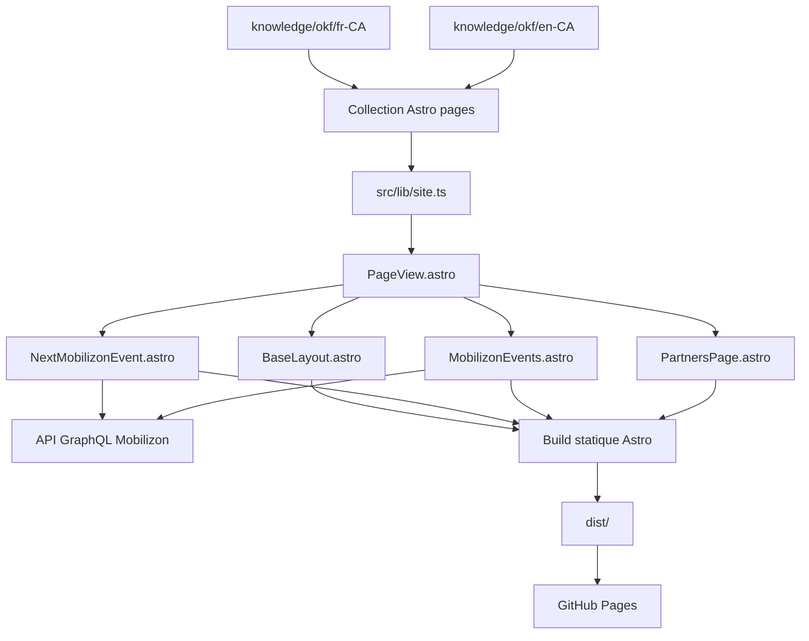

# Architecture du site GUM365

## Objectif

Le site GUM365 est un site statique Astro avec une séparation nette entre :

1. la connaissance éditoriale,
2. la présentation,
3. les données événementielles dynamiques,
4. le déploiement.

Cette séparation permet de modifier la majorité des pages sans toucher au routage Astro.

## Architecture logique



## Couche de contenu

La collection `pages` est déclarée dans `src/content.config.ts`.

Elle utilise le loader `glob` directement sur :

```text
knowledge/okf/{fr-CA,en-CA}/**/*.md
```

Il n'existe donc pas de duplication intermédiaire dans `src/content`.

### Champs principaux

Chaque page standard possède les champs suivants :

| Champ | Usage |
| --- | --- |
| `type` | Toujours `page` |
| `id` | Identifiant logique |
| `title` | Titre HTML et métadonnées |
| `description` | Description SEO |
| `slug` | URL publique |
| `language` | `fr-CA` ou `en-CA` |
| `source_of_truth` | `true` pour la source FR_CA |
| `translation_key` | Clé commune aux deux langues |
| `translation_of` | Lien documentaire côté traduction |
| `translation_status` | `source`, `draft`, `reviewed` ou `validated` |
| `updated` | Date de mise à jour |
| `nav_label` | Libellé de navigation |
| `nav_order` | Ordre dans la navigation |
| `hero_eyebrow` | Sur-titre du hero |
| `hero_title` | Titre du hero |
| `hero_lead` | Introduction du hero |
| `primary_*` | CTA principal facultatif |
| `secondary_*` | CTA secondaire facultatif |

La page partenaires ajoute un objet structuré `partner_program` validé par Zod.

## Résolution des pages

`src/lib/site.ts` centralise la logique de navigation :

- `getPages()` charge et trie les pages selon `nav_order`,
- `hrefFor()` transforme un slug en URL avec slash final,
- `getAlternate()` trouve la traduction à partir de `translation_key`,
- `getNav()` construit la navigation de la langue courante.

## Routage Astro

Le routage est volontairement minimal.

### Page d'accueil FR_CA

`src/pages/index.astro` recherche l'entrée dont :

```text
slug = ""
language = fr-CA
```

### Page d'accueil EN_CA

`src/pages/en-ca/index.astro` recherche l'entrée dont :

```text
slug = "en-ca"
language = en-CA
```

### Autres pages

`src/pages/[...slug].astro` appelle `getStaticPaths()` et génère toutes les autres pages à partir de leur slug OKF.

Conséquence : pour une page standard, ajouter un fichier OKF suffit. Il n'est pas nécessaire de créer un fichier dans `src/pages`.

## Composition des pages

Toutes les pages passent par `src/components/PageView.astro`.

Ce composant :

1. calcule la navigation et la traduction,
2. rend le hero,
3. active éventuellement un composant spécialisé,
4. rend le Markdown standard lorsqu'aucune page spécialisée ne remplace le corps de page.

### Comportements spécialisés

| Clé | Comportement |
| --- | --- |
| `home` | Ajoute `NextMobilizonEvent.astro` avant le contenu |
| `events` | Ajoute `MobilizonEvents.astro` avant le contenu |
| `partners` | Remplace le corps Markdown par `PartnersPage.astro` si `partner_program` est présent |

Cette convention est importante : **`translation_key` sert aussi de contrat fonctionnel**.

## Layout global

`src/layouts/BaseLayout.astro` gère :

- le header,
- la navigation,
- le sélecteur FR_CA / EN_CA,
- le thème clair / sombre,
- le footer,
- les balises canonical et `hreflang`,
- Open Graph,
- le favicon,
- la persistance du thème dans `localStorage`.

Le thème sombre est appliqué avec la classe `.dark` sur `<html>`.

## Style global

`src/styles/global.css` contient :

- les tokens de couleurs,
- les tokens sémantiques,
- les typographies,
- les styles du shell,
- les styles du hero,
- les boutons génériques,
- le contenu Markdown,
- le responsive principal.

Les composants spécialisés peuvent posséder leurs propres styles scoped, mais doivent réutiliser les variables CSS globales.

## Composants Velocity adaptés

La page partenaires utilise des composants locaux inspirés des APIs Velocity :

```text
src/components/ui/
├── data-display/
│   ├── Badge/
│   ├── Card/
│   └── Table/
├── form/
│   └── Button/
└── marketing/
    └── CTA/
```

Le projet n'a pas réinstallé toute la pile Tailwind de Velocity. Ces composants ont été adaptés aux tokens CSS du site pour rester légers.

## Données dynamiques

Le site est statique, mais les événements sont chargés côté navigateur depuis Mobilizon.

Endpoint :

```text
https://gum365.ca/api
```

Le build Astro n'a donc pas besoin que Mobilizon soit disponible. Si l'API échoue au runtime, les composants affichent un fallback vers `https://gum365.ca`.

## Build

`pnpm build` exécute :

```text
astro check
astro build
```

Le résultat statique est produit dans `dist/`.

## Déploiement

Le workflow `.github/workflows/deploy.yml` :

1. checkout le dépôt,
2. configure Node 22,
3. active pnpm 10.15.1 via Corepack,
4. installe les dépendances,
5. exécute le build,
6. sur push vers `main`, configure GitHub Pages,
7. téléverse `dist/`,
8. déploie avec `actions/deploy-pages`.

## Points d'extension recommandés

Pour garder l'architecture lisible :

- contenu standard : ajouter ou modifier OKF,
- nouveau comportement métier : créer un composant spécialisé,
- nouveau type de données structurées : étendre le schéma Zod,
- nouveau style réutilisable : enrichir les tokens ou les composants UI,
- nouvelle intégration externe : documenter l'API et prévoir un fallback,
- nouvelle route exceptionnelle : seulement si le modèle basé sur les slugs OKF ne suffit pas.
